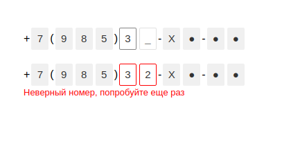

# number_verify [](https://travis-ci.org/nozimy/number_verify)

Компонент для ввода цифр номера телефона с возможной маскированной частью. 
Длина маскированной части может быть произвольной. 
Компонент имеет несколько состояний (`normal`, `hover`, `active`, `error`).

Возможности: 

- Фокус автоматически переходит в следующее поле ввода
- Переход между полями ввода можно осуществить клавишами _ArrowLeft_ и _ArrowRight_
- Для удаления значений со всех полей ввода можно выделить последний инпут, нажать и удерживать клавишу _Backspace_ 
- Оборачивает элемент `<input />` сохраняя его, т.е. при отправке формы поле сохраняется.

[Посмотреть демо](https://number-verify.now.sh)


### Скриншоты


 
### Макет


Формат входных данных для компонента:

```typescript
interface Props {
    /**
     * Маска инпута. Значения:
     * "I" - одиночный инпут для ввода одной цифры
     * "X" - серый блок с символом "X"
     * "*" - серый блок с символом "●"
     * <цифра> - серый блок с введенной цифрой
     * <не цифра> - символ отображается "как есть"
     */
    mask: string;
    
    value: string;

    valid: boolean;

    errorMessage: string;
}
```

Пример значения маски для компонента в состоянии `normal`, изображенного на макете:

```typescript
const mask = '+7(985)0II-**-**';
```


## Установка

Как только npmjs отправит автору эл. письмо для верификации аккаунта, то можно будет устанвить так:

```
npm install number_verify --save
```

Ну а пока: 

- `git clone https://github.com/nozimy/number_verify.git`
- `cd number_verify`
- `npm i`
- `npm run build`
- теперь сборка доступна в папке `dist`

## Пример использования

```html
<input id="your-input-id" />
```

```javascript
import {NumberInput} from 'path-to/numberInput.js';

const numInput = new NumberInput('your-input-id', {
	mask: '+7(985)II-X*-**',
	value: '32',
	valid: false,
	errorMessage: 'Неверный номер, попробуйте еще раз'
});

// Ваш код...

```

## API

`.value` - поле содержит введенные в инпуты значения. Если макет такой `+7(985)0II-**-**`, то длина `.value` будет равной двум (количесву `I` в макете)

## License

[MIT](LICENSE) © Nozim Yunusov


