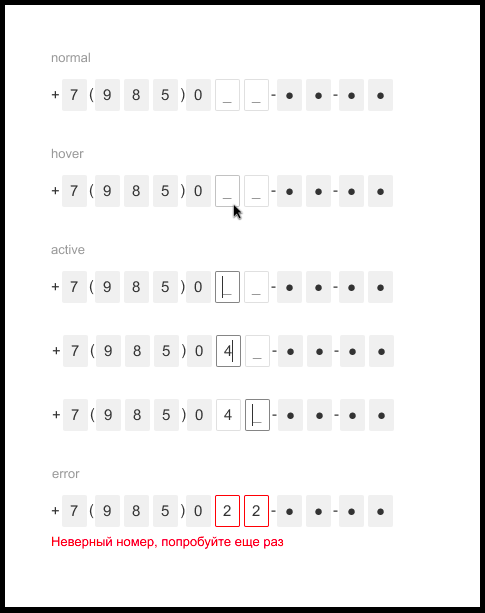

# number_verify

Компонент для ввода цифр номера телефона с возможной маскированной частью. 
Длина маскированной части может быть произвольной. 
Компонент имеет несколько состояний (`normal`, `hover`, `active`, `error`).

[See Demo](http://example.org)


Формат входных данных для компонента:

```typescript
interface Props {
    /**
     * Маска инпута. Значения:
     * "I" - одиночный инпут для ввода одной цифры
     * "X" - серый блок с символом "X"
     * "*" - серый блок с символом "●"
     * <цифра> - серый блок с введенной цифрой
     * <не цифра> - символ отображается "как есть"
     */
    mask: string;
}
```

Пример значения маски для компонента в состоянии `normal`, изображенного на макете:

```typescript
const mask = '+7(985)0II-**-**';
```

## Макет



## Screenshots

## Install

```
npm install number_verify --save
```

## Use

```
code
```

## License

[MIT](LICENSE)


